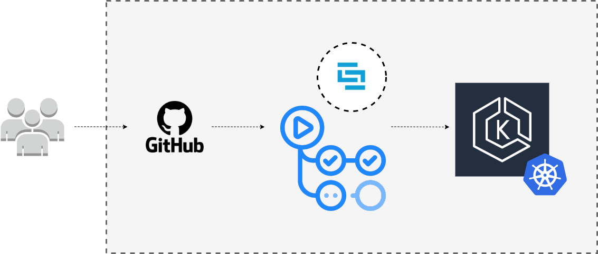

# Build & Deploy Node.js Application to Amazon EKS with Skaffold and GitHub Actions



This repository contains source code for a basic Node.js application that can be be built and deployed to an Amazon EKS cluster. During the CI stage, the application is tested, built and pushed to Docker Hub repository. After that, a connection is established with the Amazon EKS cluster before the application is deployed using Skaffold.

## Prerequisites
* [Skaffold](https://skaffold-latest.firebaseapp.com/)
* [Node.js](https://nodejs.org/)
* [kubectl](https://kubernetes.io/docs/tasks/tools/)
* [Rancher Desktop](https://rancherdesktop.io/) (for local K8s development)
* [Terraform](https://learn.hashicorp.com/tutorials/terraform/install-cli) (to create K8s cluster with IaC)

## Folder Structure

```
├── Dockerfile
├── README.md
├── manifests.yaml
├── node_modules
├── package-lock.json
├── package.json
├── skaffold.yaml
└── src
   ├── app.js
   ├── index.js
   └── test
```

## Local Development with Skaffold
To use Skaffold for local Kubernetes development and debugging on your application, ensure that you have Skaffold installed on your machine and a Kubernetes cluster with an established connection. For easy K8s development, you can make use of [Rancher Desktop](https://rancherdesktop.io/).

```
kubectl config current-context
skaffold init # run this if you don't have a Skaffold manifest file
skaffold dev # run this for continuous delivery to you K8s cluster 
```

## Create Amazon EKS Cluster with Terraform
You can create an Amazon EKS cluster in your AWS account using the source code available [here](https://github.com/LukeMwila/amazon-eks-cluster).

## GitHub Actions Configuration

```
name: 'Build & Deploy to EKS'
on:
  push:
    branches:
      - main
env:
  AWS_ACCESS_KEY_ID: ${{ secrets.AWS_ACCESS_KEY_ID }}
  AWS_SECRET_ACCESS_KEY: ${{ secrets.AWS_SECRET_ACCESS_KEY }}
  EKS_CLUSTER: ${{ secrets.EKS_CLUSTER }}
  EKS_REGION: ${{ secrets.EKS_REGION }}
  DOCKER_ID: ${{ secrets.DOCKER_ID }}
  DOCKER_PW: ${{ secrets.DOCKER_PW }}
# SKAFFOLD_DEFAULT_REPO: 
jobs:
  deploy:
    name: Deploy
    runs-on: ubuntu-latest
    env:
      ACTIONS_ALLOW_UNSECURE_COMMANDS: 'true'
    steps:
      # Install Node.js dependencies
      - uses: actions/checkout@v2
      - uses: actions/setup-node@v2
        with:
          node-version: '14'
      - run: npm install
      - run: npm test
      # Login to Docker registry
      - name: Login to Docker Hub
        uses: docker/login-action@v1
        with:
          username: ${{ secrets.DOCKER_ID }}
          password: ${{ secrets.DOCKER_PW }}
      # Install kubectl
      - name: Install kubectl
        run: |
          curl -LO "https://dl.k8s.io/release/$(curl -L -s https://dl.k8s.io/release/stable.txt)/bin/linux/amd64/kubectl"
          curl -LO "https://dl.k8s.io/$(curl -L -s https://dl.k8s.io/release/stable.txt)/bin/linux/amd64/kubectl.sha256"
          echo "$(<kubectl.sha256) kubectl" | sha256sum --check

          sudo install -o root -g root -m 0755 kubectl /usr/local/bin/kubectl
          kubectl version --client
      # Install Skaffold
      - name: Install Skaffold
        run: |
          curl -Lo skaffold https://storage.googleapis.com/skaffold/releases/latest/skaffold-linux-amd64 && \
          sudo install skaffold /usr/local/bin/
          skaffold version
      # Cache skaffold image builds & config
      - name: Cache skaffold image builds & config
        uses: actions/cache@v2
        with:
          path: ~/.skaffold/
          key: fixed-${{ github.sha }}
      # Check AWS version and configure profile
      - name: Check AWS version
        run: |
          aws --version
          aws configure set aws_access_key_id $AWS_ACCESS_KEY_ID
          aws configure set aws_secret_access_key $AWS_SECRET_ACCESS_KEY
          aws configure set region $EKS_REGION
          aws sts get-caller-identity
      # Connect to EKS cluster
      - name: Connect to EKS cluster 
        run: aws eks --region $EKS_REGION update-kubeconfig --name $EKS_CLUSTER
      # Build and deploy to EKS cluster
      - name: Build and then deploy to EKS cluster with Skaffold
        run: skaffold run
      # Verify deployment
      - name: Verify deployment
        run: kubectl get pods
```
